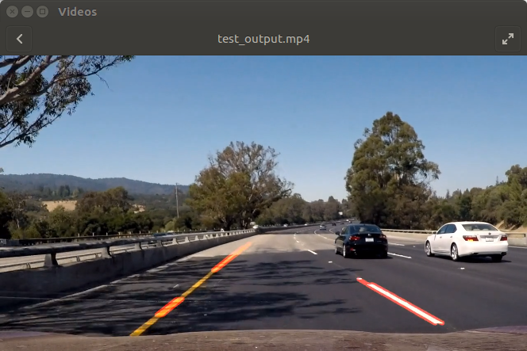
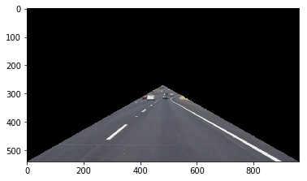
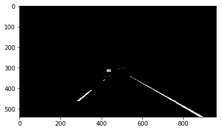
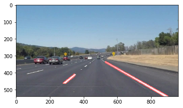

# Finding Lane Lines on the Road

## Overview, Design Refrection in Japanese
Launch  is (https://github.com/kuniyasu/udacity_homework1/blob/master/homework.ipynb)

路面のレーン検知方法について、こんかい実装した方式は、下記のステップになります。
１　画面中心より画面下部の左右への車線と下部の三角形でかこまれる空間を抜き取る
２　RGBのうち白線とオレンジ線の２色の道路上の線を抜き取る処理をおこないっています。
３　CANNYによりエッジを抽出します
４　確率的ハフの直線検出を行い直線を抽出しまる
直線として抜出された路面の線はdetectLine()関数として実装されて一括に処理されます。
レクチャの内容からは白線の抽出からオレンジ線の２つを抜き取るように拡張をおこないました。
処理をさらに良くするには膨張・縮小処理などを入れることでマークの欠如などを補完したスムーズな白線を抽出することも可能になると考えています。


> This is jupyter noitebok code. It is necessary opencv2, numpy and VideoFileClip libraries. Additonally for debugging, you should import matplot library.



## Description of Lane Line Decetion Pipeline Image Processing
#### Step 1. Invalid Region Masking



A triangle area ,that is closed by bottoms vertex and center on screen, is fixed.

> Improvementable Point: If you not sufficient that Center on screen and more adaptive controll is necessary, I will use Optical-flow or some solution.

#### Step 2. Color Select


White and orange colors are supported. Please adjust variable _white_th_ and _orange_th_.

> Improvementable Point : Binalized data is not shape sometime. I think that dilate and erode filters are effective.

> Improvementable Point : RGB color selection is depended by luminance, I suggest that RBG shold be convert to HSV color.

#### Step 3. Edge Feature Extraction Canny Filter


Edge data is generated by Binalized data.
_low_threshold_ and _high_threshold_ are adjust variable.

#### Step 4. Hough Line Detect

For lines detection, Hough conversion is used. Adjust variables are shown below.

```python:
rho = 2           # Distance resolution in pixels of the Hough grid
theta = nm.pi/180 # Angular resolution in radians of the Hough grid
threshold = 15    # Minimum number of votes (intersections in Hough grid cell)
min_line_length = 40 # Minimum number of pixels making up a line
max_line_gap = 20  # Minimum number of pixels making up a line
```

#### Step 5. Result



```python:
result = cv2.addWeighted(lines, 0.8, image, 1, 0)
 ```
 It is overlay detect line on source image.
